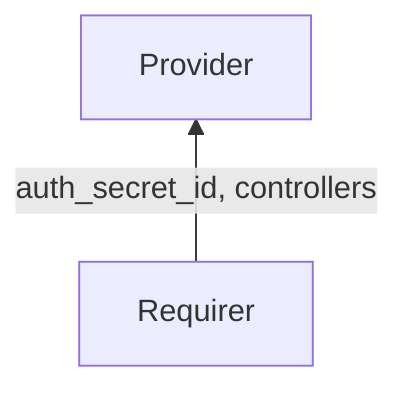

# `charmed-slurm-sackd-interface`

## Usage

This package provides the integration interface implementation for the `sackd` interface.
It enables charmed applications providing the `sackd` service (Slurm auth and cred kiosk daemon)
to exchange Slurm management data with charmed applications that require the `sackd` service.

The `sackd` requirer supplies controller data (authentication secret and controller addresses) to
the `sackd` provider through the integration databag. The `sackd` provider validates that required fields
are present before considering the integration ready.

## Installation

Add `charmed-slurm-sackd-interface` to your Python dependencies _pyproject.toml_.
Then in your Python code, import as:

```python
from charmed_slurm_sackd_interface import (
    SackdProvider,
    SackdRequirer,
    controller_ready,
)
```

## Direction



## Behavior

Data is exchanged through the Juju integration application databag. The `sackd` requirer sets `auth_secret_id`
and `controllers` on its application databag. The authentication key itself is stored as a Juju Secret,
with only the secret ID in the databag. The `sackd` provider resolves the secret to retrieve the
actual key material.

### Provider

- Is expected to validate that the application databag contains `auth_secret_id` and `controllers` before becoming ready.
- Is expected to emit `SlurmctldConnectedEvent` when the relation to `slurmctld` is created.
- Is expected to emit `SlurmctldReadyEvent` when valid controller data is available.
- Is expected to emit `SlurmctldDisconnectedEvent` when the relation is broken.

### Requirer

- Is expected to emit `SackdConnectedEvent` when a new `sackd` application is connected.
- Is expected to publish `ControllerData` with at least `auth_secret_id` and `controllers` fields populated.

## Example integration data

```yaml
provider:
  app: {}
  unit: {}
requirer:
  app:
    auth_secret_id: "secret:abc123"
    controllers: '["10.0.0.1", "10.0.0.2"]'
  unit: {}
```

## Example usages

### Provider charm

```python
"""Example sackd charm receiving controller data from slurmctld."""

import ops
from charmed_slurm_sackd_interface import SackdProvider, controller_ready


class SackdCharm(ops.CharmBase):
    """A sackd charm that receives controller data."""

    def __init__(self, framework: ops.Framework) -> None:
        super().__init__(framework)
        self.slurmctld = SackdProvider(self, "slurmctld")
        self.framework.observe(
            self.slurmctld.on.slurmctld_ready, self._on_slurmctld_ready
        )
        self.framework.observe(
            self.slurmctld.on.slurmctld_disconnected, self._on_slurmctld_disconnected
        )

    def _on_slurmctld_ready(self, event: ops.RelationEvent) -> None:
        """Handle when controller data is available."""
        data = self.slurmctld.get_controller_data()
        # Use data.auth_key and data.controllers to configure sackd

    def _on_slurmctld_disconnected(self, event: ops.RelationEvent) -> None:
        """Handle when controller data is no longer available."""
```

### Requirer charm

```python
"""Example slurmctld charm providing controller data to sackd."""

import ops
from charmed_slurm_sackd_interface import SackdConnectedEvent, SackdRequirer
from charmed_slurm_slurmctld_interface import ControllerData


class SlurmctldCharm(ops.CharmBase):
    """The slurmctld charm that provides controller data to sackd."""

    def __init__(self, framework: ops.Framework) -> None:
        super().__init__(framework)
        self.sackd = SackdRequirer(self, "sackd")
        self.framework.observe(
            self.sackd.on.sackd_connected, self._on_sackd_connected
        )

    def _on_sackd_connected(self, event: SackdConnectedEvent) -> None:
        """Provide controller data when a sackd application connects."""
        data = ControllerData(
            auth_secret_id="secret:abc123",
            controllers=["10.0.0.1"],
        )
        self.sackd.set_controller_data(data, integration_id=event.relation.id)
```
