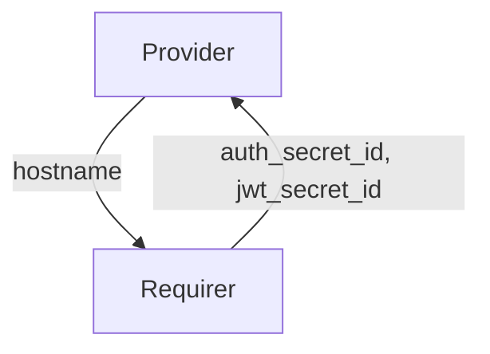

# `charmed-slurm-slurmdbd-interface`

## Usage

This package provides the integration interface implementation for the `slurmdbd` interface.
It enables charmed applications that provide the `slurmdbd` service (Slurm database daemon)
to exchange its hostname configuration and Slurm management data with charmed applications
that require the `slurmdbd` service.

The `slurmdbd` requirer supplies controller data (authentication secret and JWT secret)
to the `slurmdbd` provider. In turn, the `slurmdbd` provider publishes its hostname so that
`slurmctld` can contact the database service.

## Installation

Add `charmed-slurm-slurmdbd-interface` to your Python dependencies.
Then in your Python code, import as:

```python
from charmed_slurm_slurmdbd_interface import (
    DatabaseData,
    SlurmdbdProvider,
    SlurmdbdRequirer,
    controller_ready,
    database_ready,
)
```

## Direction



## Behavior

Data is exchanged through the Juju integration application databag in both directions. The `slurmdbd` requirer
sets controller data including Juju Secret IDs for authentication and JWT keys on its application databag.
The `slurmdbd` provider sets its hostname on its own application databag.

### Provider

- Is expected to validate that the application databag contains `auth_secret_id` and `jwt_secret_id` before becoming ready.
- Is expected to call `set_database_data` to publish `DatabaseData` containing the service hostname.
- Is expected to only interact with the integration as the application leader.
- Is expected to emit `SlurmctldConnectedEvent` when the relation to `slurmctld` is created (leader only).
- Is expected to emit `SlurmctldReadyEvent` when valid controller data is available (leader only).
- Is expected to emit `SlurmctldDisconnectedEvent` when the relation is broken (leader only).

### Requirer

- Is expected to emit `SlurmdbdConnectedEvent` when a new `slurmdbd` application is connected (leader only).
- Is expected to emit `SlurmdbdReadyEvent` when database data is available in the `slurmdbd` application databag (leader only).
- Is expected to emit `SlurmdbdDisconnectedEvent` when the `slurmdbd` application is disconnected (leader only).
- Is expected to call `get_database_data` to retrieve `DatabaseData`.
- Is expected to publish `ControllerData` with at least `auth_secret_id` and `jwt_secret_id` fields populated.

## Example integration data

```yaml
provider:
  app:
    hostname: "juju-776f33-0"
  unit: {}
requirer:
  app:
    auth_secret_id: "secret:abc123"
    jwt_secret_id: "secret:def456"
  unit: {}
```

## Example usages

### Provider charm

```python
"""Example slurmdbd charm providing database hostname to slurmctld."""

import ops
from charmed_slurm_slurmdbd_interface import DatabaseData, SlurmdbdProvider


class SlurmdbdCharm(ops.CharmBase):
    """A slurmdbd charm that provides its hostname to slurmctld."""

    def __init__(self, framework: ops.Framework) -> None:
        super().__init__(framework)
        self.slurmctld = SlurmdbdProvider(self, "slurmctld")
        self.framework.observe(
            self.slurmctld.on.slurmctld_ready, self._on_slurmctld_ready
        )

    def _on_slurmctld_ready(self, event: ops.RelationEvent) -> None:
        """Publish database hostname once controller data is available."""
        hostname = f"{self.unit.name.replace('/', '-')}.{self.app.name}-endpoints"
        self.slurmctld.set_database_data(DatabaseData(hostname=hostname))
```

### Requirer charm

```python
"""Example slurmctld charm consuming database data from slurmdbd."""

import ops
from charmed_slurm_slurmdbd_interface import (
    DatabaseData,
    SlurmdbdConnectedEvent,
    SlurmdbdRequirer,
)
from charmed_slurm_slurmctld_interface import ControllerData


class SlurmctldCharm(ops.CharmBase):
    """The slurmctld charm that consumes database data from slurmdbd."""

    def __init__(self, framework: ops.Framework) -> None:
        super().__init__(framework)
        self.slurmdbd = SlurmdbdRequirer(self, "slurmdbd")
        self.framework.observe(
            self.slurmdbd.on.slurmdbd_connected, self._on_slurmdbd_connected
        )
        self.framework.observe(
            self.slurmdbd.on.slurmdbd_ready, self._on_slurmdbd_ready
        )
        self.framework.observe(
            self.slurmdbd.on.slurmdbd_disconnected, self._on_slurmdbd_disconnected
        )

    def _on_slurmdbd_connected(self, event: SlurmdbdConnectedEvent) -> None:
        """Provide controller data when slurmdbd connects."""
        data = ControllerData(
            auth_secret_id="secret:abc123",
            jwt_secret_id="secret:def456",
        )
        self.slurmdbd.set_controller_data(data, integration_id=event.relation.id)

    def _on_slurmdbd_ready(self, event: ops.RelationEvent) -> None:
        """Handle when database data is available."""
        data: DatabaseData = self.slurmdbd.get_database_data()
        # Use data.hostname to configure AccountingStorageHost in slurm.conf

    def _on_slurmdbd_disconnected(self, event: ops.RelationEvent) -> None:
        """Handle when slurmdbd is disconnected."""
```
