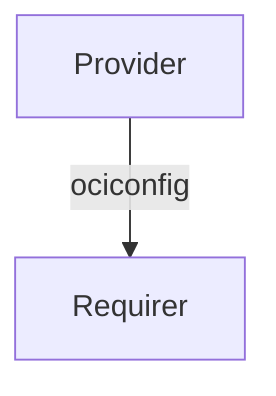

# `charmed-slurm-oci-runtime-interface`


## Usage

This package provides the integration interface implementation for the `slurm_oci_runtime` interface.
It enables OCI runtime charms - for example, Apptainer - to share their runtime configuration
with `slurm_oci_runtime` requirers like the `slurmctld` application. The `slurm_oci_runtime` requirer
consumes this data to manage the `oci.conf` configuration file. When the integration is broken,
the requirer is notified so it can remove the OCI runtime configuration.

# Installation

Add `charmed-slurm-oci-runtime-interface` to your Python dependencies.
Then in your Python code, import as:

```python
from charmed_slurm_oci_runtime_interface import (
    OCIRuntimeData,
    OCIRuntimeProvider,
    OCIRuntimeRequirer,
)
```

## Direction



## Behavior

Data is exchanged through the Juju integration application databag. The OCI runtime provider places its
configuration - an `OCIConfig` structure from `slurmutils` - in its application databag. The
`slurmctld` requirer reads this data to construct the `oci.conf` configuration file.

### Provider

- Is expected to call `set_oci_runtime_data` to publish `OCIRuntimeData` containing the OCI runtime configuration.
- Is expected to only interact with the integration as the application leader.
- Is expected to emit `SlurmctldConnectedEvent` when the relation to `slurmctld` is created.
- Is expected to emit `SlurmctldReadyEvent` when controller data from `slurmctld` is available.

### Requirer

- Is expected to emit `OCIRuntimeReadyEvent` when OCI runtime data is available in the application databag.
- Is expected to emit `OCIRuntimeDisconnectedEvent` when the OCI runtime application is disconnected.
- Is expected to call `get_oci_runtime_data` to retrieve `OCIRuntimeData`.
- Is expected to only process events as the application leader.

## Example integration data

```yaml
provider:
  app:
    ociconfig: '{"RunTimeDefault": "apptainer", "RunTimeEnvExclude": "^SLURM"}'
  unit: {}
requirer:
  app:
    auth_secret_id: "secret:abc123"
    controllers: '["10.0.0.1"]'
    slurmconfig: '{"slurm.conf": {...}}'
  unit: {}
```

## Example usages

### Provider charm

```python
"""Example OCI runtime charm providing runtime configuration to slurmctld."""

import ops
from charmed_slurm_oci_runtime_interface import OCIRuntimeData, OCIRuntimeProvider
from slurmutils import OCIConfig


class ApptainerCharm(ops.CharmBase):
    """An OCI runtime charm that provides configuration to slurmctld."""

    def __init__(self, framework: ops.Framework) -> None:
        super().__init__(framework)
        self.oci_runtime = OCIRuntimeProvider(self, "slurm-oci-runtime")
        self.framework.observe(
            self.oci_runtime.on.slurmctld_ready, self._on_slurmctld_ready
        )

    def _on_slurmctld_ready(self, event: ops.RelationEvent) -> None:
        """Publish OCI runtime data once slurmctld is connected."""
        config = OCIConfig({"RunTimeDefault": "apptainer"})
        self.oci_runtime.set_oci_runtime_data(OCIRuntimeData(ociconfig=config))
```

### Requirer charm

```python
"""Example slurmctld charm consuming OCI runtime configuration."""

import ops
from charmed_slurm_oci_runtime_interface import OCIRuntimeData, OCIRuntimeRequirer


class SlurmctldCharm(ops.CharmBase):
    """The slurmctld charm that consumes OCI runtime configuration."""

    def __init__(self, framework: ops.Framework) -> None:
        super().__init__(framework)
        self.oci_runtime = OCIRuntimeRequirer(self, "slurm-oci-runtime")
        self.framework.observe(
            self.oci_runtime.on.oci_runtime_ready, self._on_oci_runtime_ready
        )
        self.framework.observe(
            self.oci_runtime.on.oci_runtime_disconnected,
            self._on_oci_runtime_disconnected,
        )

    def _on_oci_runtime_ready(self, event: ops.RelationEvent) -> None:
        """Handle when OCI runtime data is available."""
        data: OCIRuntimeData = self.oci_runtime.get_oci_runtime_data()
        # Use data.ociconfig to write oci.conf

    def _on_oci_runtime_disconnected(self, event: ops.RelationEvent) -> None:
        """Handle when OCI runtime is disconnected."""
```
