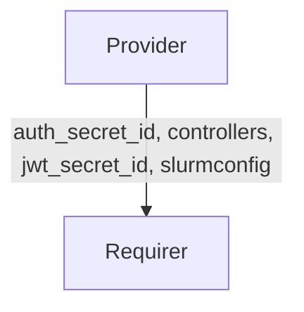

# `charmed-slurm-slurmctld-interface`


## Usage

This package provides the base building blocks for Slurm-related integration interface implementations.
It defines the `SlurmctldProvider` and `SlurmctldRequirer` base classes that all other Slurm integration
interfaces inherit from, along with common data structures, events, and utilities shared across Slurm-related
integrations.

Authentication and JWT keys are stored as Juju Secrets, and the `slurmctld` provider grants access to
those secrets on a per-integration basis. When an integration is broken, the provider revokes the departing
application's access to secrets.

`slurmctld` requirers listen for integration lifecycle events and emit higher-level events to
signal when controller data becomes available or is removed.

Charms that implement a new Slurm service integration should depend on this package and extend
`SlurmctldProvider` or `SlurmctldRequirer` as appropriate. `SlurmctldProvider` and `SlurmctldRequirer`
should not be used directly in charm code.

## Installation

Add `charmed-slurm-slurmctld-interface` to your Python dependencies.
Then in your Python code, import as:

```python
from charmed_slurm_slurmctld_interface import (
    ControllerData,
    SlurmctldProvider,
    SlurmctldRequirer,
    controller_ready,
    encoder,
)
```

## Direction



## Behavior

Data is exchanged through the Juju integration application databag. Sensitive fields like `auth_secret_id`
and `jwt_secret_id` are stored as Juju Secrets; only the secret IDs are placed in the integration databag.
The requirer resolves secret IDs into their content when reading controller data.

### Provider

- Is expected to call `set_controller_data` to publish `ControllerData` to related applications.
- Is expected to grant access to the `auth_key` and `jwt_key` Juju Secrets when an integration ID is specified.
- Is expected to revoke secret access when the integration is broken.

### Requirer

- Is expected to emit `SlurmctldConnectedEvent` when a relation is created.
- Is expected to emit `SlurmctldReadyEvent` when the provider's application databag contains data.
- Is expected to emit `SlurmctldDisconnectedEvent` when the relation is broken (unless the local unit is departing).
- Is expected to call `get_controller_data` to retrieve `ControllerData` and resolve secrets into their plaintext values.

## Example integration data

```yaml
provider:
  app:
    auth_secret_id: "secret:abc123"
    controllers: '["10.0.0.1", "10.0.0.2"]'
    jwt_secret_id: "secret:def456"
    slurmconfig: '{"slurm.conf": {...}}'
  unit: {}
requirer:
  app: {}
  unit: {}
```

## Example usages

### Requirer charm

```python
"""Example charm consuming slurmctld controller data."""

import ops
from charmed_slurm_slurmctld_interface import (
    ControllerData,
    SlurmctldRequirer,
)


class MySlurmdCharm(ops.CharmBase):
    """A charm that requires controller data from slurmctld."""

    def __init__(self, framework: ops.Framework) -> None:
        super().__init__(framework)
        self.slurmctld = SlurmctldRequirer(self, "slurmctld")
        self.framework.observe(
            self.slurmctld.on.slurmctld_ready, self._on_slurmctld_ready
        )
        self.framework.observe(
            self.slurmctld.on.slurmctld_disconnected, self._on_slurmctld_disconnected
        )

    def _on_slurmctld_ready(self, event: ops.RelationEvent) -> None:
        """Handle when controller data is available."""
        data: ControllerData = self.slurmctld.get_controller_data()
        # Use data.auth_key, data.controllers, etc.

    def _on_slurmctld_disconnected(self, event: ops.RelationEvent) -> None:
        """Handle when controller data is no longer available."""
```

### Provider charm

```python
"""Example charm providing slurmctld controller data."""

import ops
from charmed_slurm_slurmctld_interface import (
    ControllerData,
    SlurmctldProvider,
)


class SlurmctldCharm(ops.CharmBase):
    """The slurmctld charm that provides controller data."""

    def __init__(self, framework: ops.Framework) -> None:
        super().__init__(framework)
        self.provider = SlurmctldProvider(self, "slurmctld")
        self.framework.observe(self.on.leader_elected, self._on_leader_elected)

    def _on_leader_elected(self, event: ops.LeaderElectedEvent) -> None:
        """Publish controller data to all related applications."""
        data = ControllerData(
            auth_secret_id="secret:abc123",
            controllers=["10.0.0.1"],
            jwt_secret_id="secret:def456",
            slurmconfig={},
        )
        self.provider.set_controller_data(data)
```

### Building a downstream interface with `SlurmctldRequirer`

Subclass `SlurmctldRequirer` to build an interface that consumes controller data and
optionally provides service-specific data back to `slurmctld`. Pass `required_app_data`
and an `app_data_validator` to control when the integration is considered ready.

```python
"""Minimal downstream interface that extends SlurmctldRequirer."""

from dataclasses import dataclass

import ops
from charmed_hpc_libs.ops import leader
from charmed_slurm_slurmctld_interface import SlurmctldRequirer, encoder

_REQUIRED_APP_DATA = {
    "auth_secret_id": lambda value: value != '""',
    "controllers": lambda value: value != "[]",
}


@dataclass(frozen=True)
class ServiceData:
    """Data provided by the downstream service back to slurmctld."""

    endpoint: str = ""


class ServiceProvider(SlurmctldRequirer):
    """Interface used on the downstream service to consume controller data."""

    def __init__(self, charm: ops.CharmBase, /, integration_name: str) -> None:
        super().__init__(
            charm,
            integration_name,
            required_app_data=set(_REQUIRED_APP_DATA),
            app_data_validator=lambda data: all(
                v(data[k]) for k, v in _REQUIRED_APP_DATA.items()
            ),
        )

    @leader
    def set_service_data(
        self, data: ServiceData, /, integration_id: int | None = None
    ) -> None:
        """Publish service-specific data on the application databag."""
        self._save_integration_data(data, self.app, integration_id, encoder=encoder)
```

### Building a downstream interface with `SlurmctldProvider`

Subclass `SlurmctldProvider` to build an interface used on the `slurmctld` side that
provides controller data and consumes service-specific data from a downstream application.

```python
"""Minimal downstream interface that extends SlurmctldProvider."""

from dataclasses import dataclass

import ops
from charmed_hpc_libs.ops import leader
from charmed_slurm_slurmctld_interface import SlurmctldProvider


@dataclass(frozen=True)
class ServiceData:
    endpoint: str = ""


class ServiceConnectedEvent(ops.RelationEvent):
    """Emitted when the downstream service application is connected."""


class ServiceReadyEvent(ops.RelationEvent):
    """Emitted when the downstream service application data is available."""


class ServiceDisconnectedEvent(ops.RelationEvent):
    """Emitted when the downstream service application is disconnected."""


class _ServiceRequirerEvents(ops.ObjectEvents):
    service_connected = ops.EventSource(ServiceConnectedEvent)
    service_ready = ops.EventSource(ServiceReadyEvent)
    service_disconnected = ops.EventSource(ServiceDisconnectedEvent)


class ServiceRequirer(SlurmctldProvider):
    """Interface used on slurmctld to consume data from the downstream service."""

    on = _ServiceRequirerEvents()

    def __init__(self, charm: ops.CharmBase, /, integration_name: str) -> None:
        super().__init__(charm, integration_name, required_app_data={"endpoint"})
        self.framework.observe(
            self.charm.on[self._integration_name].relation_created,
            self._on_relation_created,
        )
        self.framework.observe(
            self.charm.on[self._integration_name].relation_changed,
            self._on_relation_changed,
        )
        self.framework.observe(
            self.charm.on[self._integration_name].relation_broken,
            self._on_relation_broken,
        )

    @leader
    def _on_relation_created(self, event: ops.RelationCreatedEvent) -> None:
        self.on.service_connected.emit(event.relation)

    @leader
    def _on_relation_changed(self, event: ops.RelationChangedEvent) -> None:
        if not event.relation.data.get(event.relation.app):
            return

        self.on.service_ready.emit(event.relation)

    @leader
    def _on_relation_broken(self, event: ops.RelationBrokenEvent) -> None:
        if self._stored.unit_departing:
            return

        super()._on_relation_broken(event)
        self.on.service_disconnected.emit(event.relation)

    def get_service_data(self, integration_id: int | None = None) -> ServiceData:
        """Retrieve service data from the downstream application databag."""
        return self._load_integration_data(ServiceData, integration_id=integration_id).pop()
```
